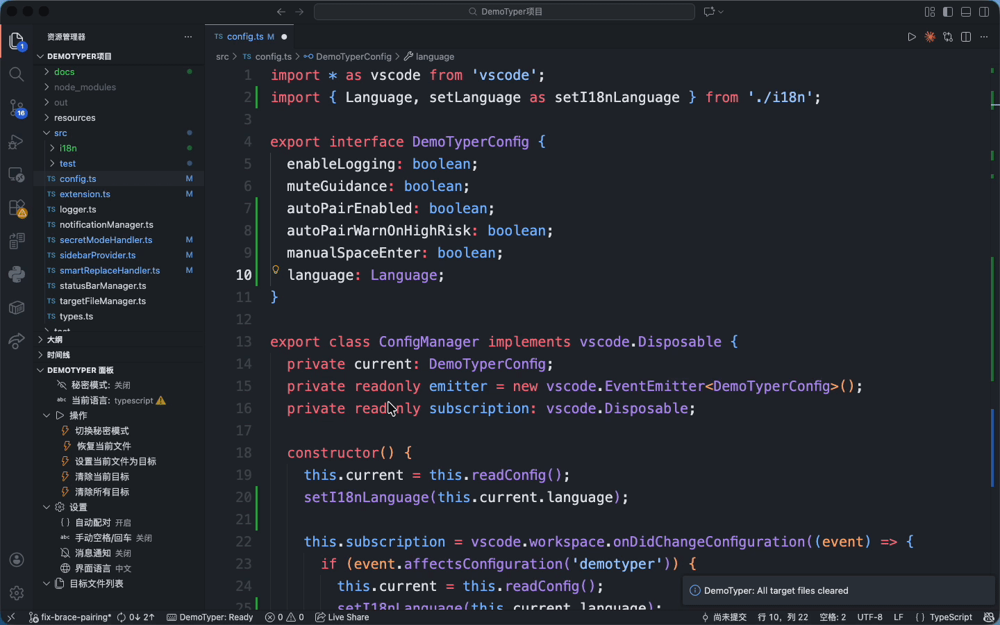

<div align="center">

# DemoTyper

**随便敲键盘，自动打出正确代码**

Press any key, output the right code

[](https://marketplace.visualstudio.com/items?itemName=demotyper.demotyper)
[](https://opensource.org/licenses/MIT)
[](https://github.com/fcmNaNo2/demotyper/releases)

</div>

## 这是什么？

录演示视频时，你需要一边写代码一边讲解，但打字太慢、容易出错？

**DemoTyper 让你随便敲键盘，插件自动帮你输出预设好的代码。** 观众看起来你在流畅地写代码，实际上你只需要专注讲解。

<div align="center">

</div>

## 适用场景

- **录制教程视频** - 专注讲解，不用担心打错字
- **直播写代码** - 保持节奏，避免尴尬停顿
- **技术分享演示** - 看起来像高手一样流畅

## 快速开始

### 1. 准备目标代码
把你想"打"出来的代码写好，保存到一个文件里

### 2. 设置目标文件
在文件资源管理器中右键点击该文件 → **Set as Demo Target File**

### 3. 打开演示文件
新建一个空文件，这是你"表演"的舞台

### 4. 开启秘密模式
按 `Ctrl+Shift+Alt+S`（Mac: `Cmd+Shift+Alt+S`）

### 5. 开始表演
随便敲键盘，代码自动出现！

## 侧边栏面板

DemoTyper 提供了一个侧边栏面板，方便你：
- 切换秘密模式
- 设置/清除目标文件
- 查看当前状态
- 调整设置

## 命令列表

| 命令 | 说明 | 快捷键 |
|------|------|--------|
| Toggle Secret Mode | 开启/关闭秘密模式 | `Ctrl+Shift+Alt+S` |
| Set as Demo Target File | 设置目标文件 | 右键菜单 |
| Clear Demo Target File | 清除目标文件 | - |
| Restore Editor from Target | 恢复编辑器内容 | - |

## 安装

### 方式一：从 VSIX 安装

1. 从 [Releases](https://github.com/fcmNaNo2/demotyper/releases) 下载最新的 `.vsix` 文件
2. 在 VS Code 中按 `Ctrl+Shift+P`
3. 输入 `Extensions: Install from VSIX...`
4. 选择下载的文件

### 方式二：从源码构建

```bash
git clone https://github.com/fcmNaNo2/demotyper.git
cd demotyper
npm install
npm run compile
npx vsce package
```

## 工作原理

1. 你设置一个"目标文件"（包含你想输出的代码）
2. 开启秘密模式后，你按下任意键
3. 插件对比当前内容和目标内容，找出下一个字符差异
4. 自动插入正确的字符

就这么简单。

## License

MIT License - 随便用

---

<div align="center">

**用 DemoTyper，让每次演示都像大神一样流畅**

</div>
